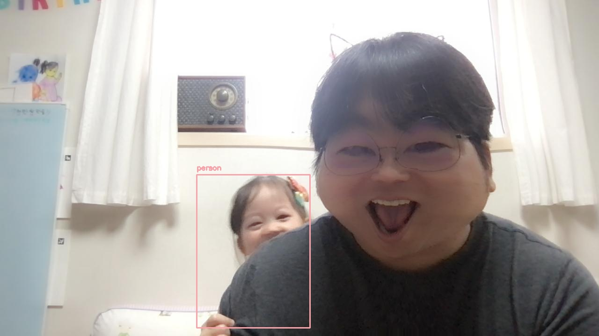

## MLOps Introduction to Machine Learning in Production

[MLOps Introduction to Machine Learning in Production](https://www.coursera.org/learn/introduction-to-machine-learning-in-production/home/welcome) 과정을 들으면서 개인적으로 공부한 내용을 정리함. 본 과정은 아래와 같이 3주 과정으로 구성되어 있다.

Week1: Overview of the ML Lifecycle and Deployment  
Week2: Select and Train a Model  
Week3: Data Definition and Baseline  

 

### Week1: Overview of the ML Lifecycle and Deployment

- ML 생명 주기의 구성 요소 식별
- ML 프로젝트 관련 Concept Drift 정의
- 배포 전략 소개: shadow, canary, blue-green 배포
- ML 모델의 반복 학습 주기와 ML 프로덕션 배포 주기 소개
- Concept Drift를 모니터링하기 위해 추적해야할 일반적인 메트릭 소개

##### 내용 정리
[Week1: Overview of the ML Lifecycle and Deployment](https://skinny-harbor-d7a.notion.site/Week-1-Overview-of-the-ML-Lifecycle-and-Deployment-e8c7f4df59ba4c21a0030af4cd7180eb) 

머신러닝 모델을 만드는 것 만큼 머신러닝 모델 시스템을 유지 관리하는 것의 중요성을 다시 상기함.  
단일 태스크가 아닌, 마치 서비스 처럼 꾸준히 성장시켜가야하는 시스템임을 인식하고,  
한번에 배포하려하지 말고 자동화의 정도 단계를 거친 배포(서비스를 성장) 전략으로 모델에 더 효과적인 성능을 낼 수 있는 학습 기회를 제공하는 것이 필요하겠다.  
모델을 사용할 서비스의 기획/개발 조직 모두 인식해야할 중요한 점이라고 생각됨.

##### Week1-ungraded-lab
- opencv를 활용해 이미지 개채 인식기 구현
- FastAPI + Uvicorn을 통해서 serving 서버를 구현
- confidence를 client에서 파라미터로 설정할 수 있도록 개선
---

Lab Code
- [server.ipynb](./week1-ungraded-lab/server.ipynb)
- [client.ipynb](./week1-ungraded-lab/client.ipynb)

---

OpenCV
- 오랜만에 비주얼한 작업이라 재미있었다.
- 인식률은 그닥??? (confidence=0.1)

FastAPI + Uvicorn
- 경량 프레임웍 +  ASGI server 구성으로 swagger를 내장하고 있고, decorator를 통해서 router를 쉽게 구성할 수 있음.
